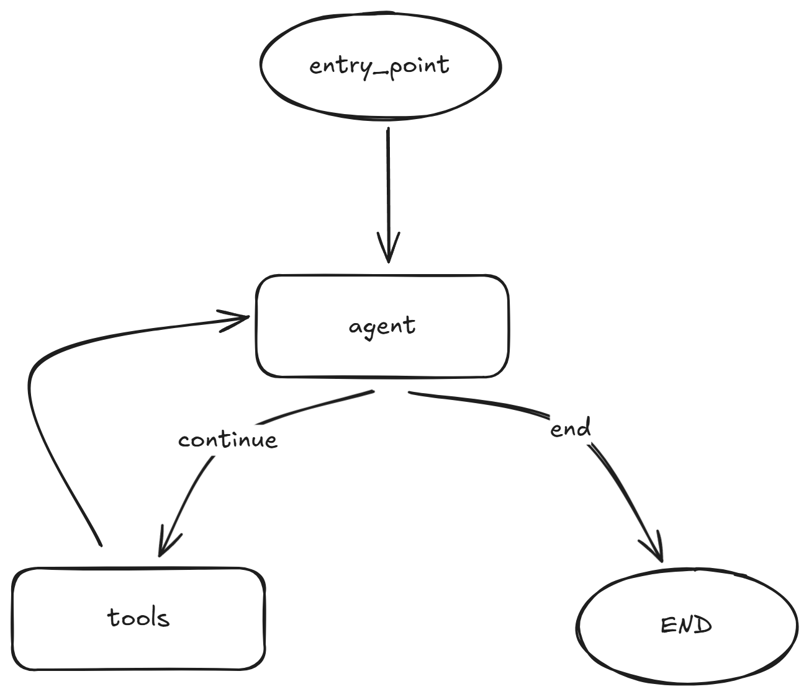

# wiki-agent

## Overview

The agent has two main functionalities:

1. auto generate wiki about given repo

    - given "facebook/zstd" or "https://github.com/facebook/zstd"
    - based on the repo, generate wiki files:
        - README.md: overview of the project
        - STRUCTURE.md: code structure of the project
        - CODE_FILE_DOC.md: documentation for each code file
        - etc.

2. based on the wiki, answer questions about the repo

    - given a question about the repo, e.g., "How to build the project?"
    - based on the generated wiki files, answer the question

3. auto update wiki when repo changes

    - monitor the given repo for changes
    - when there are new commits, update the wiki files accordingly


## Structure

The agent is composed of three main parts:

1. wiki generation

For wiki generation, the agent use `Supervisor` pattern to coordinate multiple sub-agents:

When user give a repo like "facebook/zstd", the agent will run automatically without further user input.

Below is the flow:

```
user input -> supervisor-agent -> wiki files
```

The process can be seen as a pinned chain of agents:

```
user input -> check repo cloned -> repo analysis -> generate wiki files
```

The `repo analysis` step can be further decomposed into multiple steps:

```
repo analysis -> code structure analysis -> code file analysis
```

2. question answering

the first step has generated the wiki files, so before answering questions, the agent will first load the wiki files into vector database.

When user ask a question about the repo, the agent will first retrieve relevant wiki files from vector database, then answer the question based on the retrieved wiki files.

3. update wiki

The agent will monitor the given repo for changes. When there are new commits, the agent will automatically update the wiki files based on the new code changes.

---

build_app workflow: 
```python
def _build_app(self):
        workflow = StateGraph(AgentState)
        workflow.add_node("agent", self._agent_node)
        workflow.add_node("tools", self.tool_executor)
        workflow.set_entry_point("agent")
        workflow.add_conditional_edges(
            "agent",
            self._should_continue,
            {
                "continue": "tools",
                "end": END,
            },
        )
        workflow.add_edge("tools", "agent")
        return workflow.compile(checkpointer=self.memory)
```
<div align=center>

</div>

## Technologies Used

- LangGraph
- Tree-sitter
- LLMs (Deepseek, Qwen, GPT-4, etc.)
- Vector Databases (Chroma, FAISS, etc.)
- GitHub/Gitee APIs
...


