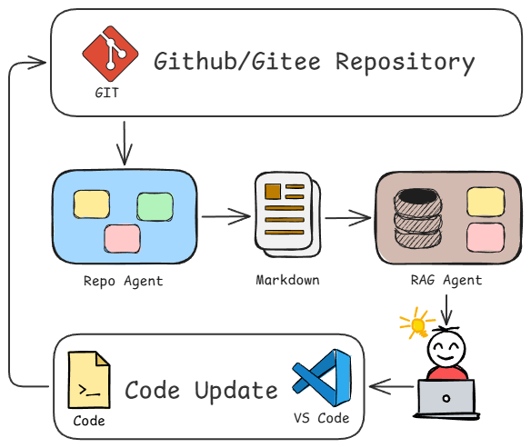
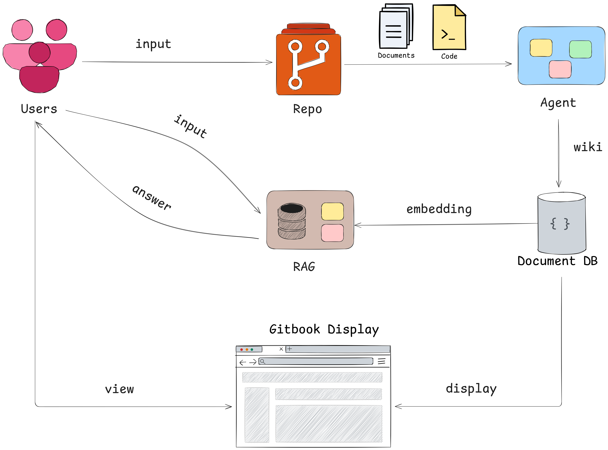

## repo-agent

> An LLM-powered repository agent for **wiki-style documentation** and **deep codebase understanding**.

[](LICENSE)
[](https://www.python.org/)
[](#-architecture--design)
[](#-architecture--design)

English · [简体中文](./README_CN.md)



`repo-agent` is designed to help developers and teams **build, maintain, and query repository documentation automatically**.
It is especially useful when you want to:

- **Quickly understand a newly inherited project**
- **Build or improve high‑quality Wiki / developer documentation**
- **Continuously track repository changes and keep docs up to date**

---

## ✨ Features

- **Automatic Wiki generation**
  - Generate comprehensive documentation for any GitHub / Gitee repository: project overview, commit history, PR history, release notes, code file documentation, and more.
- **Repository QA**
  - Ask natural language questions about the repository, powered by the generated Wiki and code understanding.
- **Automatic documentation updates**
  - Monitor repository changes (commits, merged PRs, new releases) and incrementally update the related documents.
- **Multi‑agent orchestration**
  - Use LangGraph / LangChain to orchestrate multiple agents that handle code parsing, documentation generation, vector store writing, QA, etc.

---

## 🧠 Why repo-agent?

Modern repositories evolve quickly: frequent commits, complex dependency structures, multiple contributors, and sparse documentation.
Keeping a **trustworthy, human-readable wiki** in sync with the codebase is hard and time‑consuming.

`repo-agent` combines:

- **LLMs** for high‑level summarization and natural language interfaces
- **Code parsers** for precise structural understanding
- **Graph-based agent orchestration** for robust, extensible workflows

With these, it can:

- Turn raw repositories into **navigable documentation spaces**
- Serve as a **knowledge layer** for downstream tasks (RAG QA, dashboards, review tools, etc.)

---

## 🚀 Quick Start

```bash
git clone https://github.com/sse-orz/repo-agent
cd repo-agent

# Install backend dependencies
uv sync

# Configure environment
cp .env.example .env
# then edit .env with your keys and settings

# Start core agents
make repo    # repo documentation & wiki pipeline
make rag     # retrieval-augmented QA pipeline
make server  # backend API service
```

For a web UI:

```bash
cd web
pnpm install
pnpm dev
```

Then open the printed URL in your browser to interact with `repo-agent`.

---

## ⚙️ Installation & Setup

### 1. Prerequisites

- **OS**: Linux / macOS (WSL2 is supported)
- **Python**: `>= 3.10` recommended
- **Dependency management**: `uv` (recommended), or your own Python environment manager
- **Node.js**: `>= 18` recommended for the frontend, using `pnpm` as the package manager

### 2. Backend dependencies

Using `uv`:

```bash
uv sync
```

> If `uv` is not installed, refer to its official documentation or install the dependencies defined in `pyproject.toml` manually.

### 3. Environment variables

```bash
cp .env.example .env
# Edit .env to configure API keys, model settings, GitHub / Gitee tokens, etc.
```

Common configuration items (refer to the actual `.env.example`):

- **LLMs**: API keys for DeepSeek / Qwen / OpenAI / other models
- **Code hosting**: GitHub / Gitee access tokens
- **Vector databases**: Chroma / FAISS storage paths or connection settings

---

## 📚 Usage

### 1. Repo Agent: documentation generation & maintenance

```bash
make repo
```

This triggers workflows that:

- Analyze the structure of a target repository
- Generate / update Wiki-style markdown documentation

### 2. RAG Agent: retrieval‑augmented QA

```bash
make rag
```

This starts the retrieval pipeline to:

- Ingest docs and code snippets into the vector store
- Answer questions such as “Where is this function implemented?” or “What are the dependencies of this module?”

### 3. Backend API server

```bash
make server
```

This typically starts an HTTP API service (e.g. based on FastAPI) that powers the web UI and external integrations.

### 4. Frontend dev server

```bash
cd web
pnpm install
pnpm dev
```

Open the URL printed in the terminal to access the `repo-agent` web interface.

---

## 🏗 Architecture & Design

### Overall architecture



### Agent graph


### Repo Agent
#### Sub‑graph


#### Moe-Agent


### Prompt design
#### Sub-graph prompt


#### Moe-Agent prompt


### Backend

- Built with **Python** and **LangGraph / LangChain** to orchestrate multiple agents
- Integrates multiple LLM providers (DeepSeek, Qwen, GPT‑4, etc.)
- Provides unified abstractions to make it easy to plug in new models and data sources

### Frontend

- Built with **Vue.js + Vite**
- Provides UI for repository selection, task progress tracking, documentation preview, and interactive QA

---

## 🛠 Tech Stack

- **LangGraph / LangChain**: Agent workflow orchestration
- **Tree-sitter**: Multi-language code parsing (functions, classes, AST, etc.)
- **LLMs**: DeepSeek, Qwen, GPT‑4, and others
- **Vector databases**: Chroma, FAISS for efficient semantic search
- **APIs**: GitHub / Gitee integrations for repository data
- **Frontend**: Vue.js + Vite
- **Backend**: Python (FastAPI or similar framework)

---

## 🤝 Contributing

Contributions are very welcome! You can help in several ways:

- **Issues**: Report bugs, request features, or suggest improvements
- **Pull Requests**: Submit code changes (ideally with a short design explanation)
- **Documentation**: Improve usage docs, examples, and architecture descriptions

Before opening a PR, it is recommended to:

- Ensure basic tests / lint checks (if available) pass
- Keep the coding style consistent with the existing codebase

---

## 📄 License

This project is released under the **MIT License**. See the `LICENSE` file for details.
