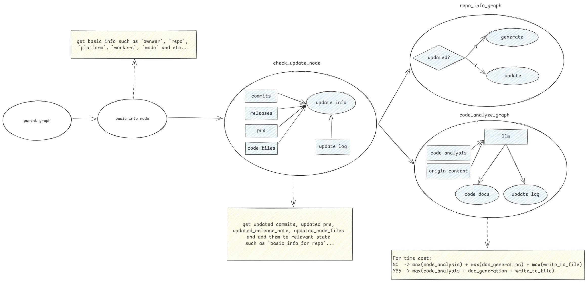

## repo-agent

> 一个面向 **仓库级文档生成** 和 **代码库理解** 的 LLM 智能代理框架。

[](LICENSE)
[](https://www.python.org/)
[](#-架构设计)
[](#-架构设计)

[English](./README.md) · 简体中文


`repo-agent` 帮助你**自动生成、维护和查询代码仓库文档**，尤其适合：

- **快速熟悉一个新接手的项目**
- **为已有项目补齐 / 升级 Wiki 与开发文档**
- **持续追踪仓库变更并保持文档同步更新**

---

## ✨ 核心特性

- **自动生成 Wiki 文档**
  - 为 GitHub / Gitee 仓库生成：项目概览、提交历史、PR 记录、Release 说明、代码文件说明等。
- **仓库级问答**
  - 基于生成的 Wiki 与代码语义结构支持自然语言问答，例如“某个函数在哪实现”“这个模块依赖了哪些组件”等。
- **自动增量更新**
  - 监听仓库的 Commit / PR / Release 变更，按需更新对应文档，而不是全部重跑。
- **多 Agent 协同编排**
  - 基于 LangGraph / LangChain 构建多智能体编排流，覆盖代码解析、文档生成、向量存储写入、检索问答等任务。

---

## 🧠 为什么需要 repo-agent？

现代仓库通常具有：

- 复杂依赖关系与多语言代码
- 高频提交与多人协作
- 文档缺失或长期失真

手动维护一份**可信、可读、与代码实时同步的 Wiki** 成本极高。

`repo-agent` 结合：

- **LLM**：高层语义总结与自然语言交互
- **代码解析**：依托 Tree-sitter 等工具精确理解代码结构
- **图式编排**：使用 LangGraph 组织子图和多 Agent 流程

从而把代码仓库变成一个：

- **可导航的知识空间**（按模块 / 文件 / 变更维度组织）
- 可为下游任务（RAG 问答、代码评审辅助、知识看板等）提供支撑的 **知识中枢**。

---

## 🚀 快速开始

```bash
git clone https://github.com/sse-orz/repo-agent
cd repo-agent

# 安装后端依赖
uv sync

# 配置环境变量
cp .env.example .env
# 编辑 .env，填入各类 API Key / 模型配置 / GitHub/Gitee Token 等

# 启动核心 Agent
make repo    # 仓库文档 & wiki 生成流水线
make rag     # 检索增强问答流水线
make server  # 后端 API 服务
```

启动前端：

```bash
cd web
pnpm install
pnpm dev
```

在浏览器中打开终端输出的地址即可使用 `repo-agent` 的 Web 界面。

---

## ⚙️ 安装与配置

### 1. 环境要求

- **操作系统**：Linux / macOS（支持 WSL2）
- **Python**：推荐 `>= 3.10`
- **依赖管理**：推荐使用 `uv`，也可自行管理虚拟环境
- **Node.js**：前端推荐 `>= 18`，包管理工具使用 `pnpm`

### 2. 安装后端依赖

```bash
uv sync
```

> 如未安装 `uv`，可参考其官方文档，或根据 `pyproject.toml` 中的依赖手动安装。

### 3. 配置环境变量

```bash
cp .env.example .env
# 在 .env 中配置各类密钥和参数
```

常见配置项（请以实际 `.env.example` 为准）：

- **LLM 相关**：DeepSeek / Qwen / OpenAI 等模型的 API Key 与模型名
- **代码托管平台**：GitHub / Gitee 访问 Token
- **向量数据库**：Chroma / FAISS 的存储路径或连接信息

---

## 📚 使用说明

### 1. Repo Agent：文档生成与维护

```bash
make repo
```

主要包含：

- 解析目标仓库结构
- 生成 / 更新对应的 Wiki 风格 Markdown 文档

### 2. RAG Agent：检索增强问答

```bash
make rag
```

主要包含：

- 将文档和代码片段写入向量库
- 支持基于自然语言的仓库级问答

### 3. 后端 API 服务

```bash
make server
```

通常会启动一个基于 FastAPI（或类似框架）的 HTTP 服务，供前端和其他客户端调用。

### 4. 前端开发服务器

```bash
cd web
pnpm install
pnpm dev
```

打开终端输出的本地地址即可访问 `repo-agent` 的 Web UI。

---

## 🏗 架构设计

### 总体架构


### Agent 图


### Repo Agent 子图



### Prompt 设计


### 后端

- 使用 **Python** + **LangGraph / LangChain** 协调多个 Agent
- 支持多家 LLM 提供商（DeepSeek、Qwen、GPT‑4 等）
- 抽象统一接口，方便扩展新的模型与数据源

### 前端

- 基于 **Vue.js + Vite**
- 提供仓库选择、任务进度展示、文档预览、问答交互等界面能力

---

## 🛠 技术栈

- **LangGraph / LangChain**：Agent 工作流编排
- **Tree-sitter**：多语言代码解析（函数、类、AST 等）
- **LLMs**：DeepSeek、Qwen、GPT‑4 等大模型
- **向量数据库**：Chroma、FAISS，用于高效语义检索
- **API 集成**：GitHub / Gitee 仓库数据接入
- **前端**：Vue.js + Vite
- **后端**：Python（FastAPI 或类似框架）

---

## 🤝 参与贡献

欢迎通过以下方式参与本项目：

- **Issue**：提交 Bug 反馈、功能需求或改进建议
- **Pull Request**：提交代码改动，建议在描述中简单说明设计思路
- **文档**：补充 / 修正使用文档、示例与架构说明

在提交 PR 前建议：

- 确保本地基础测试 / Lint（如有）通过
- 保持与当前代码风格一致

---

## 📄 许可证

本项目基于 **MIT License** 开源，详情请见仓库中的 `LICENSE` 文件。
